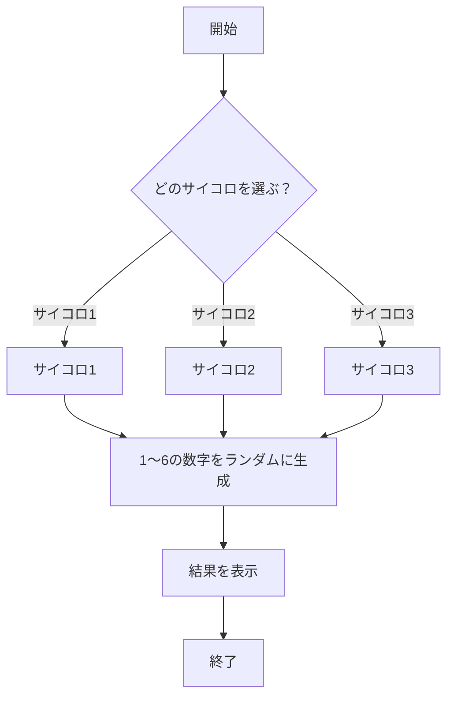
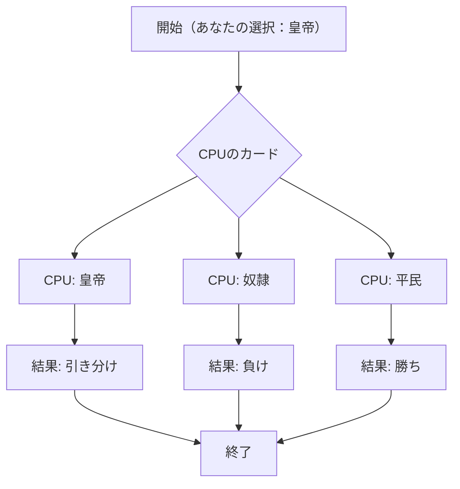

# webpro_06
## このプログラムについて
## ファイル一覧
ファイル名 |説明
-|-
app5.js | プログラム本体（ダイスとeカードのプログラムを追加）
public/janken.html | じゃんけんの開始画面
views/janken.ejs | じゃんけんのテンプレートファイル
views/dice.ejs | ダイスのテンプレートファイル
views/ecard.ejs | eカードのテンプレートファイル

1. cd でプログラムの入っているファイルまで開きnode app5.js　でサーバーを開始
1. 別のターミナルを開き　telnet localhost 8080　を入力しその後にGET /luck HTTP/1.1　と　Host: localhost　を入力する（この二つは改行する）
1. Webブラウザで
```javascript
localhost:8080/janken
```
にアクセスする
1. 自分の手をグーとチョキとパーの中から選び勝負！というボタンを押すとCPUが3つの手の中からランダムで手を選びCPUの手と勝敗が表示され勝利数と試合数がカウントされる

```mermaid
flowchart TD;

start["開始"];
choose["自分の手を選ぶ（グー・チョキ・パー）"];
cpuChoose["CPUの手をランダムに生成"];
resultCheck{"勝敗の判定"};

win["勝ち"];
lose["負け"];
draw["引き分け"];
end["終了"];

start --> choose --> cpuChoose --> resultCheck;

resultCheck --> |勝ち| win --> end;
resultCheck --> |負け| lose --> end;
resultCheck --> |引き分け| draw --> end;
```


1. cd でプログラムの入っているファイルまで開きnode app5.js　でサーバーを開始
1. 別のターミナルを開き　telnet localhost 8080　を入力しその後にGET /luck HTTP/1.1　と　Host: localhost　を入力する（この二つは改行する）
1. Webブラウザで
```javascript
localhost:8080/dice
```
にアクセスする
1. サイコロ1とサイコロ2とサイコロ3というボタンがありいずれかのボタンを押すとランダムで1〜6の数が選ばれサイコロの出目が表示される




1. cd でプログラムの入っているファイルまで開きnode app5.js　でサーバーを開始
1. 別のターミナルを開き　telnet localhost 8080　を入力しその後にGET /luck HTTP/1.1　と　Host: localhost　を入力する（この二つは改行する）
1. Webブラウザで
```javascript
localhost:8080/ecard
```
にアクセスする
1. 皇帝と奴隷と平民というボタンがありいずれかのボタンを選ぶとCPUがランダムで三つの中から選びCPUのカードの種類と自分の選択したカードの種類と結果が表示され試合数と勝利数がカウントされる




```mermaid
flowchart TD;

start["開始"];
choose["自分のカードを選ぶ（皇帝・平民・奴隷）"];
cpuChoose["CPUのカードをランダムに生成"];
resultCheck{"勝敗の判定"};

win["勝ち"];
lose["負け"];
draw["引き分け"];
end["終了"];

start --> choose --> cpuChoose --> resultCheck;

resultCheck --> |勝ち| win --> end;
resultCheck --> |負け| lose --> end;
resultCheck --> |引き分け| draw --> end;


