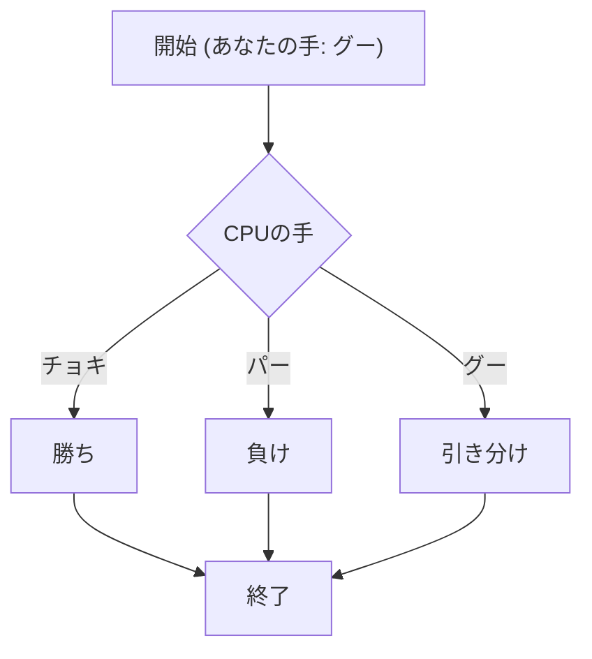
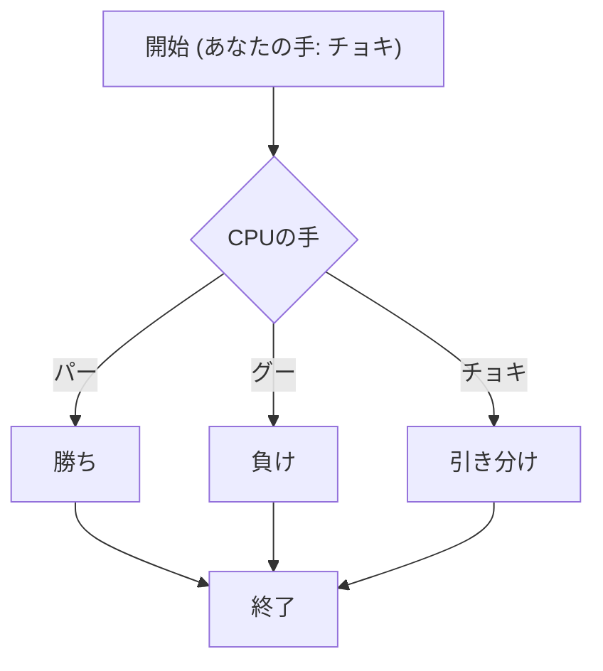
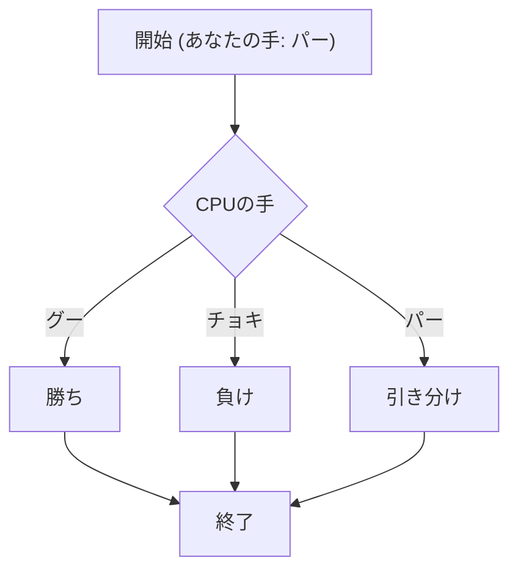
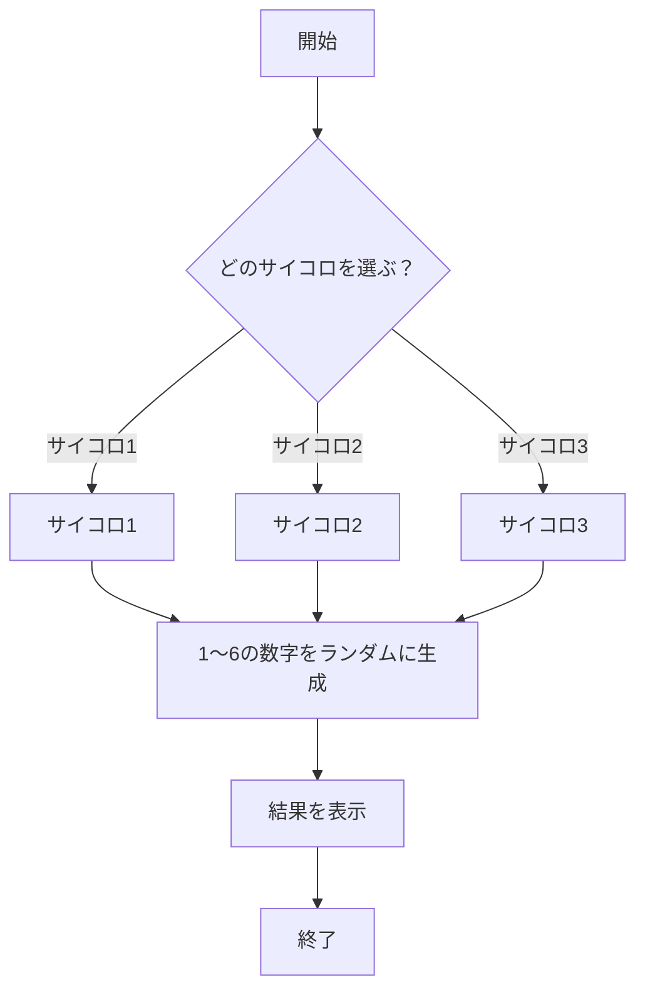
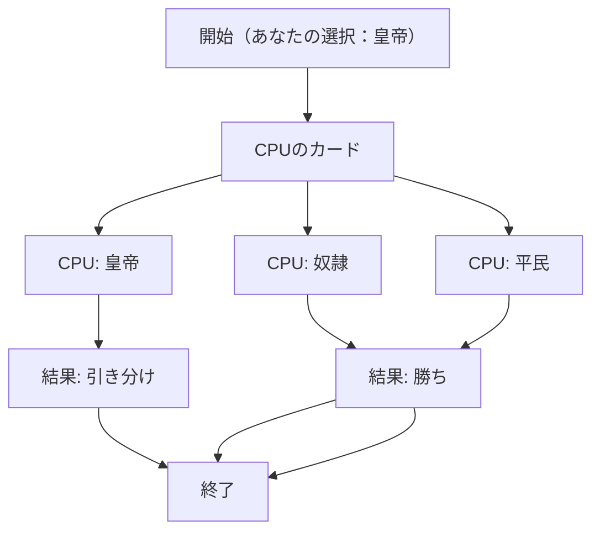
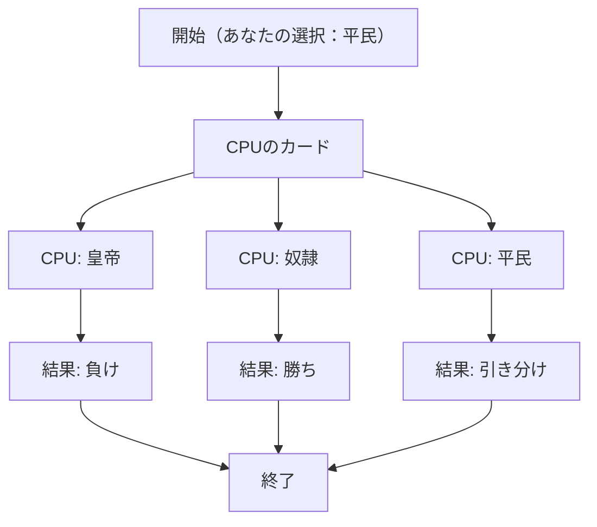
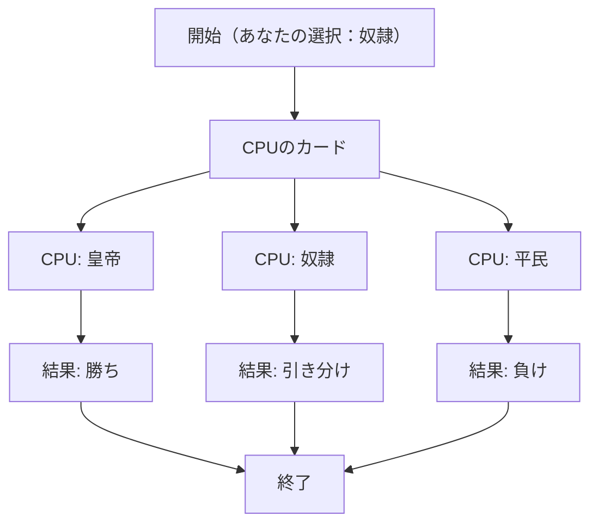

# webpro_06
## このプログラムについて
## ファイル一覧
ファイル名 |説明
-|-
app5.js | プログラム本体（ダイスとeカードのプログラムを追加）
public/janken.html | じゃんけんの開始画面
views/janken.esj | じゃんけんのテンプレートファイル
views/dice.esj | ダイスのテンプレートファイル
views/ecard.esj | eカードのテンプレートファイル
```javascript
localhost:8080/public/janken
```
1. ```app5.js```を起動する
1. Webブラウザでlocalhost:8080/public/jankenにアクセスする
1. 自分の手をグーとチョキとパーの中から選び勝負！というボタンを押すとCPUが3つの手の中からランダムで手を選びCPUの手と勝敗が表示され勝利数と試合数がカウントされる








```javascript
localhost:8080/public/dice
```
1. ```app5.js```を起動する
1. Webブラウザでlocalhost:8080/public/diceにアクセスする
1. サイコロ1とサイコロ2とサイコロ3というボタンがありいずれかのボタンを押すとランダムで1〜6の数が選ばれサイコロの出目が表示される




```javascript
localhost:8080/public/ecard
```
1. ```app5.js```を起動する
1. Webブラウザでlocalhost:8080/public/ecardにアクセスする
1. 皇帝と奴隷と平民というボタンがありいずれかのボタンを選ぶとCPUがランダムで三つの中から選びCPUのカードの種類と自分の選択したカードの種類と結果が表示され試合数と勝利数がカウントされる







