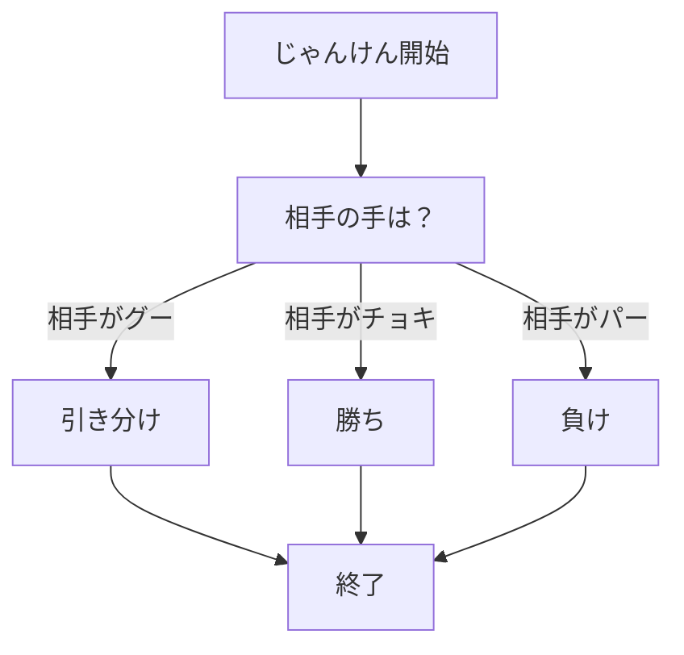

# webpro_06
## このプログラムについて
## ファイル一覧
ファイル名 |説明
-|-
app5.js | プログラム本体（ダイスとeカードのプログラムを追加）
public/janken.html | じゃんけんの開始画面
views/janken.esj | じゃんけんのテンプレートファイル
views/dice.esj | ダイスのテンプレートファイル
views/ecard.esj | eカードのテンプレートファイル
```javascript
localhost:8080/public/janken
```
1. ```app5.js```を起動する
1. Webブラウザでlocalhost:8080/public/jankenにアクセスする
1. 自分の手を入力する




